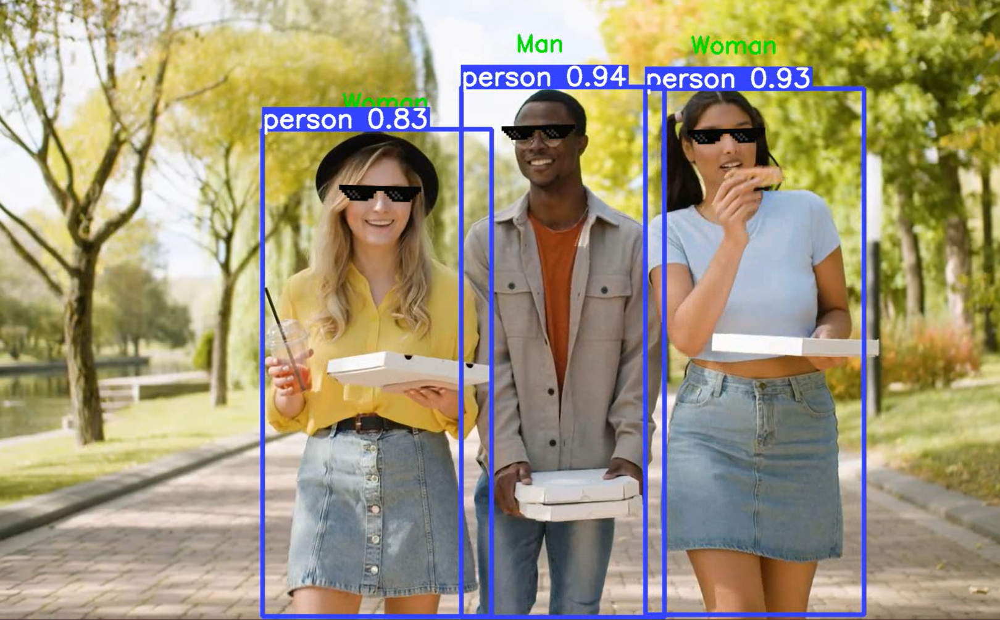

# Face and Object Detection with Gender Classification

## Overview
A real-time face and object detection with gender classification and virtual glasses overlay. 




## Features
- Face detection using OpenCV's YuNet model
- Gender classification using DeepFace
- Virtual glasses overlay on detected faces
- Object detection using YOLOv5

## Requirements
- OpenCV
- NumPy
- PyTorch
- DeepFace


````
pip install -r requirements.txt
````
